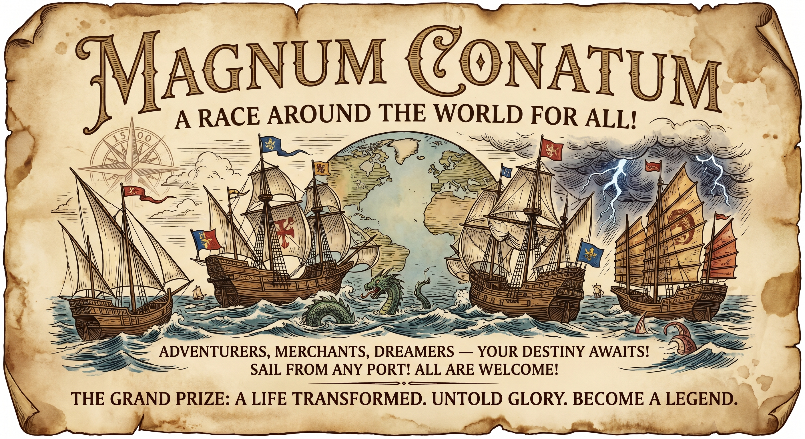

# Session 1
## Welcome to Mearth!
- It's magic Earth! The setting is the 1500s, the world exists as it did then except for all of the things that can exist in dnd 5e, can also exist in this world!
## Music
## Hamal
- He is a member of the cult know as the Children of Arietis
- Grew up in a cult
- Is super gullible and believes what everyone says
- Is not actually dumb its just been the way he was raised
- Thinks hes a cleric and has grown up around a bunch of clerics but is not a cleric and cannot do the cleric things
- he is actually a pretty powerful socerer
- And he does not know it, but he is actually devil royalty
	- his father and the royal devils were hunted for their power by the organization running the race
- When his horns started coming in the church thought they could use him for a prophecy of destruction
- But as they couldn't figure out a way to fully control his magic
## Herbie Hancock
- Kicked out of a band
- Is a drummer bard
- Dragonborn
- Wants to play the lute
- Has no thumbs for some reason
- Not very good at playing the lute
## Jan Janszoon
- Son of the most famous blacksmith and weapon technologist in Amsterdam.
- 20 years old
- Legendary sword wielder who has been training with swords since he could walk
- Lost left arm when he was 16 in a dual.
- His whole family is dead
- Wants to journey out on this ship to redeem himself and create a good life for his little brother
- From a smaller town right outside amsterdam
## Malachi
- Intolerant of other faiths and the worshipping of other gods?
- Believe Gods will is change
- Would die to recover a lost relic of his religion (he is a bit of a zealot)
- Blindly trusts others that profess faith in my God
- Malachi grew up in a small community of devout Catholics. He thought it would be "cool" and "different" to tag onto the Protestant Reformation, and would constantly bring it up with his friends. Eventually he no longer recognized where the posturing ended and true belief began, ultimately devoting his life to his faith. As his friends were going to college, he decided to join Martin Luther's bandwagon, following him around Europe like a deadhead. He references "Marty" constantly, and strives to live up to his image.
## Outline
### Who Knows who?
- To account for the players that aren't here, the others will be written to have known at least one of the people showing up to sign up and were planning on being a part of their crew
- Jan knows Boagrius
- Hamal knows Agamemnon
- Herbie had met Malachi while Herbie was touring (taverns) around Europe
- He thought malachi was a bit crazy in how zealous he was about his religion but found him to be quite entertaining and an otherwise good guy
- When they had most recently bumped into each other, Herbie was telling him how they both need to get out of Europe, as thats what is holding them both back.
	- Herbie thinks its just not the right market fit for his talents
	- And he suggests Malachi could spread his religion to everyone everywhere they go, beating the catholics to the punch, taking it to em
- Each player will start in their own situation and we will bring them together at the boat yard sale
### Old mates and old wounds
- As Malachi and Herbie walk the streets, on his way in, Herbie will see his old bandmates
	- He can try to hide from them, but if they see him they will approach and ask him how he is doing
	- They will also be doing the race, as promo for their latest collection of ballads
		- Describe the band members (all bards, maybe some multi-class):
		- The lead singer: **Gwendolyn Smotherweather** is a half-elf. She is gorgeous and had a  fling with Herbie when he was a part of the band. She is with Damian now. She is sheepish upon greeting Herbie. She had been one of the ones to agree to kick Herbie out. It was a deep betrayal. She is a cleric / bard, grew up singing at church, but hasn't been inside of a church in 8 years. She is a former catholic and wears a cross with a circle and the mother mary engraved in the center. Malachi will make a religion check, dc of 5.
		- Lutest: **Damian Cool** is a human, he has actually become pretty famous as a lutest int he continent. He also was one of the driving forces between Herbie and the band going there separate ways. He is a multiclassed Bard / Rogue.
		- Double Bass: **Balthazar Dimadome** is a dragonborn, a nepo baby of the very wealthy and influential Dimadome family. He is pretty indifferent to everything around him so when all the drama with herbie was going on, he didnt really care or notice what was happening. He smokes a lot of opium.
		- New Drummer: **Angrid the Radical** she is a towering orc that is actually a very good and awesome drummer. She is very enthusiastic (multiclassed as a barbarian). Is really positive in such a way that she doesn't understand social context such as that she basically replace herbie in the band. She is actually a huge Herbie fan, which is why she wanted the job. She is also a better drummer than Herbie but no one says that out loud.
### Father's Legacy in the Window
- As Jan walks the streets, is his face showing or not? We will say that he is trying to keep a low profile. Taking notice of where all the guards are positioned. 
	- He will walk past a armor shop with one of his father's pieces hanging in the window
	- Describe the shop owner:
		- **Gregorious Clapper**: He is a very, very large Goliath. He wears an enormous quarter laced shirt that looks like it was custom made from the hides of a number of animals. His pants are normal brown slacks that are not too tight but fight him like high waters, resting 4 inches above his ankles. His shoes are made of wood and look like chuck taylors.
		- He is very happy and loud.
		- He laughs almost all the time at the start of his sentences
		- He will talk to you all day just to keep you in his shop
		- He doesn't really want to sell the things in his shop, he is rather found of them
		- He mostly just has the shop so that people stumble by and he can fill his time having pleasant chats. In other words he is a big chiller.
		- He is a big crier and big baby though, and loves other goliaths, so Jan will have an advantage. 
	- It will be a really nice piece of armor but will be too much money for him
	- The armor and price:
		- Adamantine plat armor
		- He will say "For you my friend, an amazing deal... 1000 GP, 50% off!"
	- It will be difficult, but he might be able to talk the shop keeper into it using his sob story
### Oh Look, Magic!
- Hamal will be there, sent by his cult, to join the race to supposedly spread their word and gain favor with the group sponsoring the event 
	- Truth be told, many of the higher ups of the organization are scared of Hamal
	- They understand what he is and his true power better than he does
	- They told him it was a task only he could do, and that the whole world depended on his success, and as always, he believed them
		- This may actually be more true than even the cult members know
- As Hamal enters the city there will be a magic show. If he stops to watch the magic show, after the show the magician will attempt to sell him some snake oil
- Magician's name: **Talfar Telefair** - he is a human warlock / rogue
	- He is mostly just a conman using his magic to fool people and commit crimes
	- He is actually sponsored by a pretty major devil that gives him his powers (The uncle of Hamal)
	- Talking to Hamal he senses that familiar magic coarsing within him
	- He will ask him about where is he from and what he does for a living
	- He will be very surprised by this and think that he must be sensing someone else and getting confused, proceeding to scam him anyway
### Too many sailors, not enough boats
- When each of the groups gets there, there will only be one last boat (or a few boats in stock). The person selling the boats, **Howie Rattner**, will be scalping since he knows many people want to participate is the race of all races, the Magnum Conatum.
	- **Howie**: An old and oddly short half-orc with a forehead so big it looks like a visor. He talks with the accent of a 1950s mobster, and is wearing a bunch of gold in the medium of three gold rings on every finger on his right hand.
	- He is dressed in what looks like black poofy shorts, gold tights, and black knee high boots.
	- His shirt is equally as poofy as his pants and it is also black with green and gold polkadots all over
	- He is also wearing dimming glasses, a recent fashion fad among those who wish to be rich (sunglasses)
	- One of his teeth is gold and has a diamond in the middle
- Howie will make an announcement that they only have a few boats left and mostly larger ones. As always, it's first come first serve.
	- "And y'all know how supply and demand goes... the less boats I got the more expensive they gonna be. hey don't blame me, thems the laws of nature."
- As the listening crowd scrambles in panic to form groups and try and rent boats or figure out a plan, our crew will be pushed together.
- When they go to talk to the person that works for Howie he will say the current price is double whatever gold they have at the moment.
	- If the crew can make the right persuasion check, he will take a little bit off and hold a ship for them, giving them a time the next day, six hours before the all night festival marking the start of the race the next day
### Get it how you live
- They have to go out and make the money
	- options are dualing, gambling, talent show / performance contest, there is also a trivia contest
	- while they are walking through the street, Malachi will notice a number of catholics who are all raising money by preying and giving sermons on the street.
	- what they are fund raising for is their own participation in the race
	- they claim it is to bring glory to god
- Gambling Games
	- Some sort of race bets
	- black jack but with magic
	- slots
- Dualing
	- Anyone can sign up for the dualing tournament
	- There are three opponents I will draft, in increasing level of strength
	- I will roll a dice to determine which one it is that you face
	- Characters:
		- **Sinbad Greelok**: A tall, lanky human, Swashbuckling Rogue, wears all black including an all black head wrap. He a has a curled black mustache and a goatee
			- AC 18
			- HP: 15
			- Initiative: +5
			- Multi-attack: one with dagger (dagger can be thrown and exploded) and one with his rapier (he rolls a d4, he must call even or odds, if he's right he gains 1/4 of the hit points dealt rounded down). 
				- Dagger +5 to hit: deals 1d4 + 3 damage, 1d8 fire damage if triggered to explode
				- Rapier +5 to hit deals 1d8 piercing damage + 3
			- Passive Perception: 17
			- Charisma: +4, +4
			- str: +1, +1
			- con: +4, +4
			- int: +1, +1
			- dex: +5, +8
			- wis: 0,0
			- Fancy Footwork: When you hit someone you get a free disengage with them
			- Rakish Audacity: If you are up close and personal with the person with no one around, automatic sneak attack
			- Sneak attack: 3d6 additional damage when having advantage
		- **Georgie Blackpowder**: An elven Gunslinger
			- AC: 15
			- HP: 15
			- Initiative: +3 with advantage
			- Passive Perception: 16
			- Quickdraw: At the start of its turn, it takes an attack with its revolver, it the remaining hp is lower than the damage, you go down
			- Revolver: +3 to hit, 2d8 on hit
			- Whip: +3 to hit, 1d4 on hit, can be used to ensare or incapacitate an enemy (they have to make a dex save) below a 6 they cant move or make an action, below a 10 they have disadvantage on the next attack
			- Reactions: Combat role: Can negate all damage from anything requiring a dex save
		- **Borsch Brownstone**: Dwarven Barbarian
			- _**Reckless.**_ At the start of its turn, the berserker can gain advantage on all melee weapon attack rolls during that turn
			- AC: 13
			- str: +3, +3
			- Init + 1
			- Great axe: 1d12 + 3 slashing
			- Also a big fan of throwing people, once grappled its 1d6 for every 10ft the person is thrown
			- spinning throw, enables him to throw someone up to 30 ft if he roles above a 15 + str modifier
			- SEE MONSTER MANUAL
	- Rules of dualing:
		- Everyone gets limited to 15 HP, if you have less than that you do not get 15 hp
- Performance contest
	- Describe some of the other acts
	- Whoever participates will need to actually do their talent for the group
	- How they do affects the modifier I give their performance role
	- There are three judges:
		- **Simon Cloak**: A local man heavily involved in the arts hailing from London, known as being kind of a dick and pretty hard to impress. He is a half-orc and eternally looks grumpy.
		- **Paula Andouille**: A celebrity judge, former singer who toured all around the continent for decades. She is super positive and tells everyone they have a very bright future and that she loves them. Even if she says no to them for her vote
		- **Randy Johnsburg**: A well regarded musician who worked his way up starting as a touring musician supporting major acts, plays a large number of instruments. He then began composing after 10 years touring and became one of the best composers of his time. He says his real instrument is the pen. He's always gotta be real with you dog.
- The trivia is exactly what it sounds like
	- 1rst place: 200 GP
	- 2nd place: 100 gp
	- 3rd place: 50 gp
	- The other groups will roll to see how they do on each round
	- The rogues will try and cheat / mess up the other parties
	- The participants will get to make history checks
	- The role depends the level of the hint they get
	- The trivia is a mix of dnd trivia and trivia about the state of the world in the 1500s
	- Describe some of the other people playing trivia and the MC
		- Most of the people in the crowd look like nerds, wearing the robes of wizards in training
		- Most of them wear glasses and carry around their, heavy, invasive grimoires. 
		- There is also a group of people dressed in black cloaks (all snickering and rogues) who will be trying to win by cheating
		- MC is **Alexi Tribek**: Sleek old man dwarf, amazing voice, seems like a good dude. Wears a navy suit.
		- There will be one druid there who is just killing it in the first round. He will be accompanied by the ranger Cam.
		#### Trivia
		##### DND questions
		###### Easy
		- What is the difference between a sorcer, warlock, and wizard?
			- A sorcerer's magic is innnate
			- A wizard studies magic
			- A warlock has a sugar deity
		- What does a paladin who has broken his oath become?
			- Oath breaker paladin
		- Tieflings are descendants of what planar beings?
			- Devils / Fiends
		- Healing word is a what level spell?
			- Level 1
		- What do barbarians love to do?
			- rage
		###### Medium
		- What does rule zero state of DnD?
			- The DM has the power to override or change any rule
		- Dark elves are also commonly referred to as?
			- Drow
		- What is the primary difference between the way devils and demons act?
			- Devils are lawful evil and believe in hierarchy while demons believe in pure chaos
		- A mimic's false form is usually in the shape of what kind of item?
			- Wooden chest
		- ninth level spell that transports you instantly to another plane?
			- Gate
		##### Hard
		- Which rogueish archetype is known of as a powerhouse in the first round of combat?
			- Assassin
		- Halflings are a race of creatures taking inspiration from what fictional race?
			- Hobbits
		- What popular homebrew monster consumes the memory of its victims on top of its organic form?
			- The false hydra
		- What is the fairies homeland?
			- Feywild
		- What is the demons homeland?
			- Abyss
		##### 1500s trivia
		###### easy
		- What european hero was burned at the stake by the roman catholics in 1430 and later went on to become the patron saint of france?
			- Joan of arc
		- Who was it that painted the sistine chapel?
			- Michelangelo
		###### medium
		- Who mistook manatees for mermaids in 1493 and said they were not as beautiful as they were painted
			- Christopher Columbus
		- What was the chinese dynastic in power throughout the 1400s and 1500s
			- ming
		###### hard 
		- What years interrupted Henry VI reign over England?
			- 1461 - 1469
		- What explorer circumnavigated the entire globe in 1522?
			- Juan Sebastian Elcano
		- What letter was added to the english alphabet in the 1500s?
			- J
### Night before the race
## Getting the boat
- Kragor intimidates the rep into a better deal
- down payment was 327
- the terms are 4.5% compounding semi-annually
#### Nothing like a family reunion
- Malachi runs into his family
- KRAGOR WILL MAKE AN ANIMAL HANDLING CHECK WITH ADVANTAGE
- His family is actually a group of dopplegangers who are using his family to begin an infiltration of the catholic church
- The reason the dopplegangers act so strange is that Malachi has not lived at home for quite some time so they have never observed their interaction
- when they interrogated the family, they mostly spoke poorly of him but upon reading their thoughts, they found only love and concern
	- This made the dopplegangers think the family was trying to trick malachi in order to raise some sort of alarm to him that they are acting strange (but really they just end up doing this to themselves)
- His father is a member of the holy council of the pope, advising the pope in the evolving geo-political intricacies of the current age.'
- All three of his sisters will run up and hug him, then quickly move to stand behind their father, as they normally do
	- Shadraq
	- Mishaq
	- Abedmago
- They will treat Malachi incredibly well, even being happy to see him
- His father will talk briefly about the upstart Martin Luther and how he is a radical that only seeks to create chaos and create a less pious, less god-fearing world
- Rather than berating him for his faith, his father will instead refer to it as just a phase and ask him when he intends to return home to the fortune and piety that is waiting for him
- His mother will seemingly dote over him, placing her hands around his face, feigning holding back tears as she says just how much she has missed you
	- She will mention a childhood memory of how they used to get cannolis after church on sundays as a boy
	- On a successful history check, Malachi will recall that she has not mentioned these fond memories since they were a regular occurence
- He has three sisters, all younger than him, all in the process of becoming nuns
	- most of the time, their father prevents them from speaking
	- Malachi doesn't have much of a relationship with them at all
- The dopplegangers have been hired by the group **running** the canatum to be their pawns in the race and also infiltrate the church
- If the party gets suspicious and decides to follow the group, they may hear them talking about this in a tent or maybe even see them shape-shift into someone else
	- They will see a small cage, around the size of a cat
- If they fight them, they will be getting their shit rocked until the city guard comes in and breaks it up
- Kragor begins to smell the of cat pee
- This incidentally leads the crew in the direction of Malachi's family
- They almost get in a confrontation but are interrupted by the cities fire department who had gotten word from some of the folks who ran out.
#### Cant run from the past
 - Bogey will see Jim Crow
- If Jim Crow sees him he will come up to him a berate him
- He will ask him where his babysitter Tony Hawk is
- He will tell him that ever since he left, BlueJay Leno has taken over the top spot. Seems like he doesn't even notice hes gone
- He would say everyone is wondering where he is and when he is coming back, but honestly it seems everyone has forgotten about you
- He will ask him what he is doing here anyway. 
#### Bad men from the town
- Bo will run into a group of men who served in his arms unit with him
- They will ask him to have a drink with him
- They will ask him why he is even going on this journey, and if he is still watching out for that trouble maker Jan, they will ask why he even continues to do that?
- they will also tell him that the son of the baron (the baron is the man who had Jan's family executed) is also taking part of the canatum
- they will tell him to be careful, that he wouldn't doubt the baron's son, Pete Tettertinkle, will most likely use this as an opportunity to finish the job
#### Amys character
- may happen upon some information about where the first location is going to be (Twighland)
- If cam can be crafty enough to get the right information, they may be able to leave early and get a head start
- Try and work in some kind of animal handling (this would work well for Corey's character as well)
- Maybe have them do a shooting contest (dual?) with Georgie Blackpowder
	- Georgie will confront him, saying how he has heard tell of a handsome gun-slinging, horse-riding man from across the world who decided to try his luck in the new-world
#### Ham gets bullied
- The party may run into a group of occultists from Arietus
- They will be Ham's contemporaries in the cult
	- Most of them are the children of members of the cult, mostly high ranking members
	- A few of them are children of the leader of the cult
	- In the group there are 8 of them
	- The notable names (all children of the leader, take their mother names):
		- gerald tightwearer
		- beatrix globalwarmer
		- Ysabel dingleberg
- They will greet him and immediately start mocking him
	- they greet him porky
	- one will say they can't even believe ham managed to find the city let alone a group of people stupid enough to join him
	- they will say they used to think he was dumb as an ox until he was outwitted by the cows they kept at the farm, once getting locked in a pen while they all got out (this was when ham was a child, they locked him in the pen)
	- they will start betting on what animal or beast it was that ham's loser mother got involved with in order to spawn him
- eventually they start spellcasting to fuck with him
	- thaumaturgy
	- prestigitation
	- suggestion
	- command
	- tasha's hideous laughter
	- phantasmal force
	- Vicious mockery
	- reduce
	- feeblemind
- Heimdall Huerter will break it up, telling the children to run off
- He will give Ham the feywild shard before he leaves
#### Extra stuffs
- During the all night festival the crew will have the opportunity to do some shopping and get supplies for their journey
- If the crew comes up short of money, they can of course try and steal a ship.
- Before folks set sail for the Conatum, **SilberZunge** will announce the rules of the race, as well as the prize - a million dollars + the adventure of a life time sponsored by **The Worlds Most Generous**.
- If the crew does decide to steal a ship and gets caught (there will be one or two drunk fellas on board the morning after the festival)
	- They will yell for help, if the crew is unable to set sail before the second round of combat, the true owners of the boat will arrive and join the fight
	- The group of people they are robbing will be a group of guards from Jan's hometown
- If they don't try and steal the ship, a group of the guards from Jan's hometown will try and rob them of their ship.
- This should end either with them setting sail or with their first day at sea having been complete.
- On their first day at Sea, they will be attacked by sea monsters
## Magnum Canatum
- The Conatum is put on by an organization of philanthropists and international magnates **TMGG - The World's Most Great & Generous**. 
- The promotion is that they want to find the most capable crew in the world for an adventure that they wish to sponsor.
- They have spent a pretty penny spreading word far and wide that anyone who can gather a crew and wrangle a boat is welcome
- "A Hero is Someone with the Courage to Tame Wild and Strange Lands!"
- Little does everyone know, they are actually trying to put together an army for colonization.
- The richest people in the world at the time are trying to divide up the planet into their own dominions and want to use the best participants in the race as their militia to take over each and every country.
- They will select people from different countries and manipulate them into thinking they are doing a particular expedition to this one nation that they either despise or know nothing about.
- Make sure there is actually political in-fighting within the group
- Also some gov's will probably support this
- Some will see this as a chance to stage their own revolution.
### Rules
- The first main rule is that THERE ARE NO RULES AT SEA AS IT IS THE DOMINION OF NO NATION, IT BELONGS TO THE MAIN WITH THE MOST MOXY
- The race will be run in a series of short segments to far away lands.
- At each location, a child may or may not be given to all participants.
- The next location is provided three days after the first participant arrives to location.
- Each group of participants will be given a notification idol
- This is a frog statue for the group, it sings a ribbit for like 45 seconds real loud as its notification noise
- You must check in and register your attendance to continue the race, any team caught skipping locations will be disqualified
## Boat Robbery Gone Wrong
- If they attempt to steal the boat, it will be a series of stealth, slight of hand, and perception / investigation checks
- If they don't attempt to steal the boat, they themselves will find **George and Harvey trying to steal the boat** as they make their way down to set out. 
- It will be a stealth check to see if they are seen slipping onto the boat and how much noise they make, not if they aren't
- It will be an investigation to determine if they find the person passed out in the bathroom of the boat
	- He is a really big dude named **Brontomerus** who is a berserker barbarian.
	- When he enters the fray, he will not yell for help but will scream a very loud and aggressive scream that will bring his comrades (two other guys, **George and Harvey**, one of which is a fighter and the other is a rogue).
- Berserker with 40 HP
- bandit captain with 25 hp
- guard (he will probably die)
- If they have a boat (the party) these people will be sent by Damien Cool to sabotage Herbie on his journey
- If they are stealing a boat, it will be the boat of damien cool's band
## Sirens Song
- It will look like a group of mermaids on these rocks in the middle of the sea
- Their song is a sort of illusion magic which hides their true form and messes with the senses of those who hear it
- Sailors sail in circles drawing ever closer to the rock until they get close enough and so hypnotized by the song that they don't even notice as the monsters take their first bite
- What kind of monsters: 
	- Sirens x 3
	- HP: 15
	- get detect thoughts and sleep that they can cast two per day each
	- can shape shift into human, mermaid, or its true monster form
	- **Multiattack**. The siren makes two attacks with her claws.
	- **Claw**. _Melee Weapon Attack_: +5 to hit, reach 5 ft., one target. _Hit_: 8 (2d6 + 1) slashing damage.
	- **Luring Song**. The siren sings a magical melody. Every humanoid and giant within 300 feet of the siren that can hear the song must succeed on a DC 14 [Wisdom](https://www.5esrd.com/using-ability-scores#TOC-Wisdom) saving throw or be [charmed](https://www.5esrd.com/gamemastering/conditions/#Charmed) until the song ends. The siren must take bonus action on its subsequent turns to continue singing. It can stop singing at any time. The song ends if the siren is incapacitated. While [charmed](https://www.5esrd.com/gamemastering/conditions/#Charmed) by the siren, a target is incapacitated and ignores the songs of other sirens. If the [charmed](https://www.5esrd.com/gamemastering/conditions/#Charmed) target is more than 5 feet away from the siren, the target must move on its turn towards the siren by the most direct route, trying to get within 5 feet. It doesn’t avoid opportunity attacks, but before moving into damaging terrain, such as lava or a pit, and whenever it takes damage from a source other than the siren, the target can repeat the saving throw. A [charmed](https://www.5esrd.com/gamemastering/conditions/#Charmed) target can also repeat the saving throw at the end of each of its turns. If the saving throw is successful, the effect ends on it. A target that successfully saves is immune to this siren’s song for the next 24 hours.
## Run in with the first ship?
- This will be an encounter with a christian ship! or maybe damien's ship?
### Ship combat
- 
## The first Island
- The first island will be Twighland, the island of mirrors
	- located where jan mayen is
- This is an island of mimics, dopplegangers, and the valley of the uncanney
	- Making your way through this island is much like playing mimesis